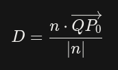

# Quadric Error Metric

## Formulas

### Plan Equation
*ax + by + cz + d = 0*

### Normalized Vector
*a² + b² + c² = 1*

### Norm of vector
*|n| = sqrt(a² + b² + c²)*

### Point-Plan Distance
Distance of *P0* to a plan *(a, b, c, d)*. *P0 = (x0, y0, z0)*

*D = abs(ax0 + by0 + cz0 + d) / sqrt(a² + b² + c²)*

Where does it come from? Scalar projection: 

In this case, *Q* satisfies *aQx, bQy, cQz + d = 0*

QP is a vector from a point that belongs to the plan an an arbitrary point that we want to measure the distance to the plan.

### Quadratic Point-Plan Distance
*D² = (ax0 + by0 + cz0 + d)² / (a² + b² + c²)*